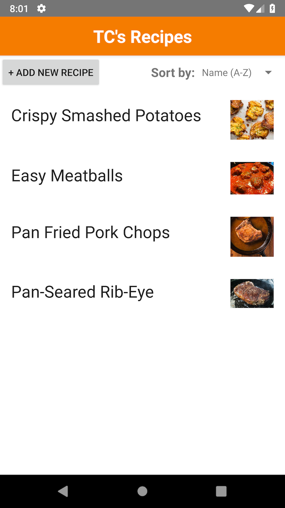
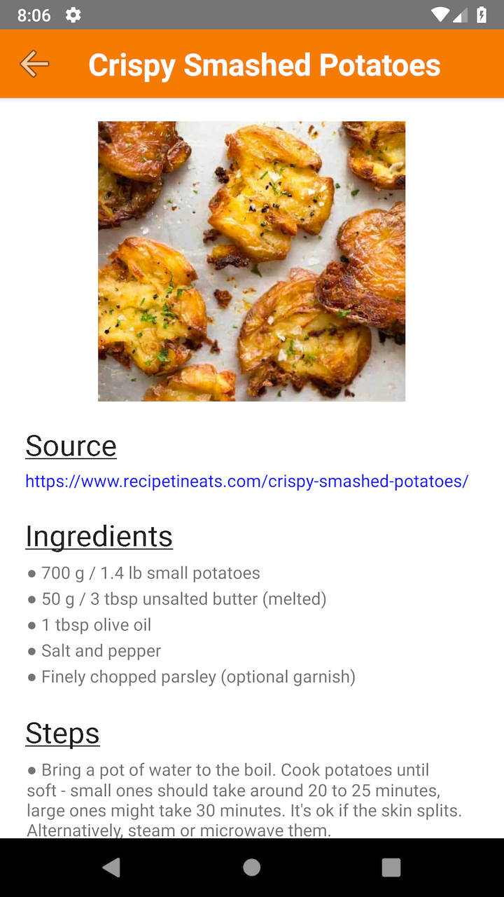
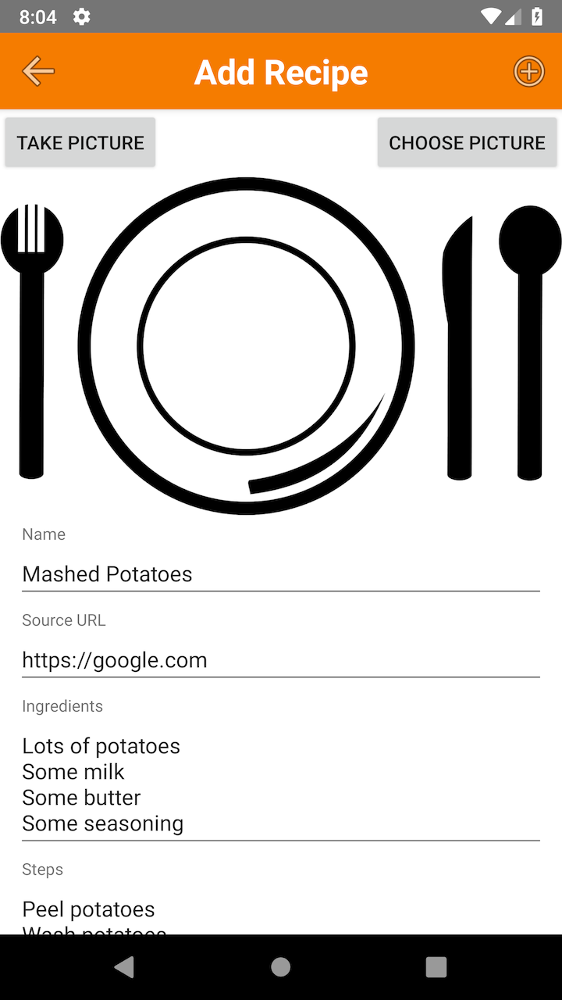
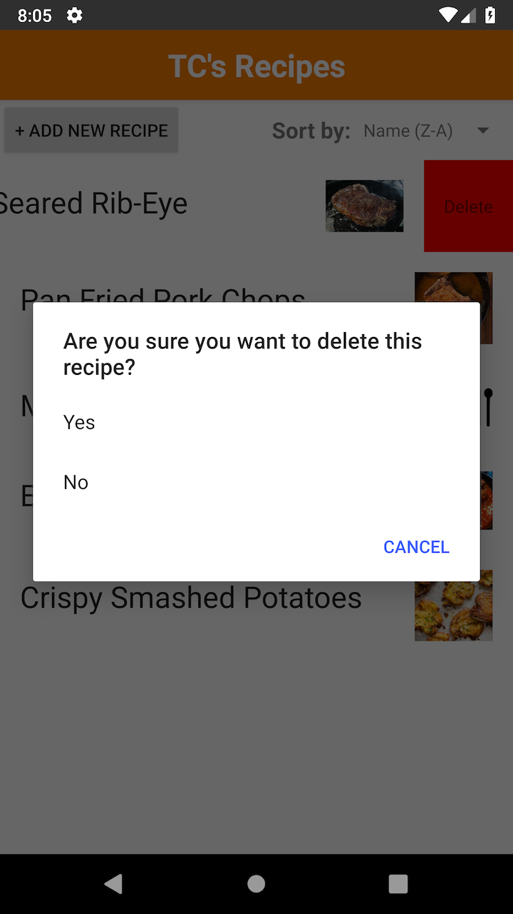

# TC's Recipes
A mobile recipe app.

   

Powered by [Nativescript](https://www.nativescript.org/).

---
## Project Setup
* `brew install node`
* `npm install -g nativescript`
* `git clone git@github.com:elocnatsirt/tcs-recipes.git`
* `npm install`
* `tns run android` or `tns preview`
